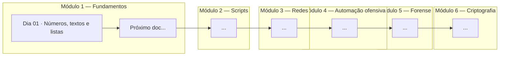

# Estudos de Python

Repositório criado pra documentar, de forma pública, todo o meu processo de aprendizado de Python — com foco em aplicação na área de cibersegurança.

A ideia é registrar cada tópico estudado em um documento próprio, com explicações em linguagem simples, exemplos práticos e um resumo do que foi aprendido. Serve tanto como material de consulta futura quanto como portfólio do progresso.

---

## Trilha de estudos

Os estudos seguem um plano dividido em módulos, começando pelos fundamentos da linguagem e avançando pra aplicações voltadas a cibersegurança (redes, automação ofensiva, forense e criptografia).



> O grafo acima cresce conforme os estudos avançam. Cada nó é um documento novo, e as setas indicam a ordem de progressão.

---

## Índice de documentos

| # | Tópico | Módulo | Status |
|---|---|---|---|
| 01 | [Introdução ao Python: números, textos e listas](./dia-01-introducao-python-numeros-textos-listas.md) | Fundamentos | ✅ Concluído |

---

## Estrutura do repositório

```
.
├── README.md
├── dia-01-introducao-python-numeros-textos-listas.md
└── ...
```

Cada arquivo segue o padrão de nome `dia-XX-titulo-do-topico.md`, contendo:

- Fonte de estudo utilizada
- Explicação didática do conteúdo
- Exemplos de código
- Resumo em tabela
- Próximos passos

---

## Objetivo final

Consolidar o aprendizado em um projeto prático aplicado a cibersegurança (ex: ferramenta de OSINT, scanner de vulnerabilidades ou análise de logs), usando como base tudo o que for documentado ao longo da trilha.

---

## Sobre

Estudos conduzidos e documentados por @ewrson_dev, desenvolvedor fullstack e criador de conteúdo educativo sobre desenvolvimento web.